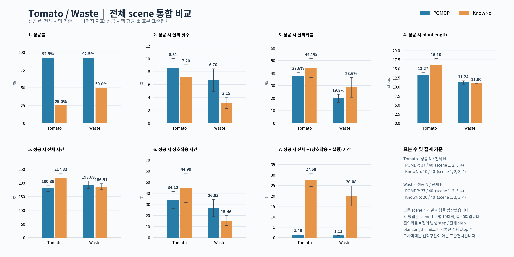

# VLM 실험 최종 분석 보고서

작성일: 2026-10-05 (Asia/Seoul)

## 완료 범위

Tomato・Waste, POMDP・KnowNo, scene 1–4에 대해 각 10회씩 총 160회이다. 기존 중간 분석 147회에 사용자 지정 Waste KnowNo scene 1의 3회와 scene 2의 10회만 추가했다. 로그의 planner・scenario 및 feedback의 use_vlm=True를 대조했고 중복・누락은 없다.

성공은 로그의 Plan Summary.success 판정이다. 영상에 따른 독립 물리 성공 검증은 수행하지 않았다. 지정된 160회를 모두 분모에 포함하며, no user selection으로 끝난 VLM 토큰 파싱 실패 1회도 실패로 포함한다. 기존 제외된 인간 실험, 이전 pilot 및 결과 없는 중단 세션을 새로 포함하지 않았다.

## 전체 결과

| Domain | Method | 성공/전체 | 성공률 | 95% Wilson CI | 질문(성공 평균 ± SD) | 질의확률(성공, %) | Steps(성공) | 전체 시간(성공, s) |
|---|---|---:|---:|---|---|---|---|---|
| tomato | pomdp | 37/40 | 92.50% | 80.14–97.42% | 8.51 ± 1.52 | 37.63 ± 3.04 | 13.27 ± 0.77 | 180.39 ± 11.18 |
| tomato | knowno | 10/40 | 25.00% | 14.19–40.19% | 7.20 ± 1.87 | 44.10 ± 7.51 | 16.10 ± 1.73 | 217.82 ± 17.78 |
| waste | pomdp | 37/40 | 92.50% | 80.14–97.42% | 6.70 ± 1.76 | 19.81 ± 3.27 | 11.24 ± 0.49 | 193.69 ± 13.52 |
| waste | knowno | 20/40 | 50.00% | 35.20–64.80% | 3.15 ± 0.88 | 28.64 ± 7.96 | 11.00 ± 0.00 | 186.51 ± 10.90 |

## Scene별 성공률

| Domain | Scene | POMDP | KnowNo |
|---|---:|---:|---:|
| tomato | 1 | 8/10 (80%) | 3/10 (30%) |
| tomato | 2 | 10/10 (100%) | 2/10 (20%) |
| tomato | 3 | 9/10 (90%) | 4/10 (40%) |
| tomato | 4 | 10/10 (100%) | 1/10 (10%) |
| waste | 1 | 10/10 (100%) | 6/10 (60%) |
| waste | 2 | 10/10 (100%) | 1/10 (10%) |
| waste | 3 | 10/10 (100%) | 10/10 (100%) |
| waste | 4 | 7/10 (70%) | 3/10 (30%) |

## 성공률 비교와 해석

| Domain | POMDP − KnowNo (%p) | Fisher exact p | Holm p |
|---|---:|---:|---:|
| tomato | 67.50 | 5.3915e-10 | 1.0783e-09 |
| waste | 42.50 | 4.3008e-05 | 4.3008e-05 |

동일 seed의 대응 실험으로 확인되지 않아 paired 검정 대신 domain별 비대응 Fisher exact 검정을 사용했다. Holm 보정은 두 domain 비교에 적용했다. 두 방법은 각 scene의 실행 수가 같지만, 성공 조건부 평균의 scene 구성은 성공 수에 따라 달라진다. 실행 간 독립성 가정, 소표본, 방법별 실행 날짜 차이를 고려해 검정은 보조 자료로 읽는다.

POMDP는 두 domain에서 각각 37/40(92.5%) 성공했다. KnowNo는 Tomato 10/40(25.0%), Waste 20/40(50.0%)이다. Waste scene 2는 POMDP 10/10, KnowNo 1/10으로 차이가 컸다.

KnowNo의 성공 실행 질문 수가 더 적더라도 질문 대상이 다르다. POMDP는 state fact에 대한 Boolean 질문, KnowNo는 action 선택 도움을 요청한다. 질문 한 건의 정보량이 같다고 가정하지 않으며, 낮은 질문 수만으로 효율 우월성을 주장하지 않는다. 실패 실행은 조기 종료할 수 있으므로 성공 평균과 전체 평균을 함께 제공한다.

## 시간과 전체 실행 평균

| Domain | Method | 질문(전체) | Steps(전체) | 전체 시간(전체, s) | 상호작용(성공, s) | 실행(성공, s) | 탐색(성공, s) | 잔여 시간(성공, s) |
|---|---|---|---|---|---|---|---|
| tomato | pomdp | 8.25 ± 1.74 | 12.65 ± 2.33 | 172.26 ± 30.85 | 34.12 ± 7.62 | 144.78 ± 6.29 | 1.38 ± 0.19 | 1.48 ± 0.19 |
| tomato | knowno | 6.50 ± 4.69 | 13.00 ± 5.51 | 155.83 ± 65.15 | 44.99 ± 13.10 | 145.15 ± 4.58 | 26.90 ± 3.07 | 27.68 ± 3.20 |
| waste | pomdp | 6.75 ± 1.77 | 10.95 ± 1.57 | 189.31 ± 28.13 | 26.83 ± 7.76 | 165.75 ± 9.34 | 0.99 ± 0.05 | 1.11 ± 0.05 |
| waste | knowno | 3.60 ± 1.86 | 9.97 ± 2.25 | 168.44 ± 36.41 | 15.46 ± 4.45 | 150.96 ± 5.94 | 19.99 ± 4.76 | 20.08 ± 4.76 |

시간은 플래너 Timing.total_time이며 GUI 세션 전체 시간과 다르다. 상호작용 시간에는 VLM 요청・피드백 처리가 포함된다. 잔여 시간은 시행별 total − interaction − execute이며 search/update/pruning 및 기타 overhead를 포함한다. 순수 탐색 시간으로 치환하지 않는다.

## 기록된 실행 설정

아래는 실행 결과 로그의 metadata에 기록된 값이다. planner의 model과 피드백 VLM의 model을 같은 것으로 추정하지 않는다. 빈 metadata는 미기록으로 표시한다.

| Domain | Method | gamma | simulations | planner model | prompt version | generation temperature |
|---|---|---|---|---|---|---|
| tomato | pomdp | 0.2 | 100 | 미기록 | 미기록 | 미기록 |
| tomato | knowno | 미기록 | 미기록 | gpt-4o | 미기록 | 미기록 |
| waste | pomdp | 0.2 | 100 | 미기록 | 미기록 | 미기록 |
| waste | knowno | 미기록 | 미기록 | gpt-4o | v1 | 0.3 |

실행별 상세 metadata는 runs.csv에 보존했다. planner metadata가 없는 POMDP 로그는 planner.log의 실행 명령으로 방법을 확인했으며 method_source에 기록했다.

## 실패 원인

| Domain | Method | 종료 이유 | N |
|---|---|---|---:|
| tomato | knowno | Expert에 의한 plan failure | 23 |
| tomato | knowno | max steps reached | 6 |
| tomato | knowno | physical action failure: pick tomato3 | 1 |
| tomato | pomdp | Expert에 의한 plan failure | 2 |
| tomato | pomdp | physical action failure: place(brl_robot, tomato3) | 1 |
| waste | knowno | no user selection | 3 |
| waste | knowno | precondition failure: pick requires detected(w3) in the current state | 2 |
| waste | knowno | precondition failure: pick requires detected(w4) in the current state | 15 |
| waste | pomdp | Expert에 의한 plan failure | 3 |

추가 Waste KnowNo scene 2 실패 9건 중 8건은 pick에 필요한 detected(w4)가 현재 상태에 없어 종료했다. 다른 1건(20261005_210208_gui)은 VLM이 제공된 후보 토큰 대신 “적절한 행동이 선택지에 없음”이라는 문구를 Token에 반환했고 feedback manager가 후보 토큰 파싱 실패를 기록한 뒤 planner가 no user selection으로 종료했다. 해당 문구만 보고 사람이 선택하지 않은 실패로 분류하지 않는다.

이는 로그가 직접 보여주는 실패 지점이다. 영상과 숨겨진 물리 상태를 대조하지 않았으므로 센서 오류・VLM 판단・action 후보 생성 중 어느 하나를 모든 실패의 원인으로 단정하지 않는다.

## 추가 13회 실행

| Scene | Session | Success | Steps | Questions | End reason |
|---:|---|---|---:|---:|---|
| 1 | [20261005_203307_gui_knowno_scene1](00_raw/waste/scene_01/knowno/20261005_203307_gui_knowno_scene1/planner_experiments/exp_wastesorting_20261005_203649_932949.txt) | True | 11 | 3 | GOAL DONE |
| 1 | [20261005_203728_gui](00_raw/waste/scene_01/knowno/20261005_203728_gui/planner_experiments/exp_wastesorting_20261005_203953_336417.txt) | False | 9 | 3 | precondition failure: pick requires detected(w3) in the current state |
| 1 | [20261005_204002_gui](00_raw/waste/scene_01/knowno/20261005_204002_gui/planner_experiments/exp_wastesorting_20261005_204323_236856.txt) | True | 11 | 3 | GOAL DONE |
| 2 | [20261005_204423_gui_knowno_scene2](00_raw/waste/scene_02/knowno/20261005_204423_gui_knowno_scene2/planner_experiments/exp_wastesorting_20261005_204739_525430.txt) | False | 10 | 5 | precondition failure: pick requires detected(w4) in the current state |
| 2 | [20261005_204921_gui](00_raw/waste/scene_02/knowno/20261005_204921_gui/planner_experiments/exp_wastesorting_20261005_205224_235819.txt) | False | 10 | 4 | precondition failure: pick requires detected(w4) in the current state |
| 2 | [20261005_205328_gui](00_raw/waste/scene_02/knowno/20261005_205328_gui/planner_experiments/exp_wastesorting_20261005_205644_645623.txt) | False | 11 | 6 | precondition failure: pick requires detected(w4) in the current state |
| 2 | [20261005_205725_gui](00_raw/waste/scene_02/knowno/20261005_205725_gui/planner_experiments/exp_wastesorting_20261005_210056_382334.txt) | False | 11 | 7 | precondition failure: pick requires detected(w4) in the current state |
| 2 | [20261005_210208_gui](00_raw/waste/scene_02/knowno/20261005_210208_gui/planner_experiments/exp_wastesorting_20261005_210249_174634.txt) | False | 1 | 1 | no user selection |
| 2 | [20261005_210358_gui](00_raw/waste/scene_02/knowno/20261005_210358_gui/planner_experiments/exp_wastesorting_20261005_210643_663440.txt) | False | 8 | 2 | precondition failure: pick requires detected(w4) in the current state |
| 2 | [20261005_210653_gui](00_raw/waste/scene_02/knowno/20261005_210653_gui/planner_experiments/exp_wastesorting_20261005_211026_519488.txt) | True | 11 | 4 | GOAL DONE |
| 2 | [20261005_211145_gui](00_raw/waste/scene_02/knowno/20261005_211145_gui/planner_experiments/exp_wastesorting_20261005_211448_048846.txt) | False | 8 | 3 | precondition failure: pick requires detected(w4) in the current state |
| 2 | [20261005_211523_gui](00_raw/waste/scene_02/knowno/20261005_211523_gui/planner_experiments/exp_wastesorting_20261005_211844_803521.txt) | False | 10 | 6 | precondition failure: pick requires detected(w4) in the current state |
| 2 | [20261005_212154_gui](00_raw/waste/scene_02/knowno/20261005_212154_gui/planner_experiments/exp_wastesorting_20261005_212440_395883.txt) | False | 8 | 2 | precondition failure: pick requires detected(w4) in the current state |

## 지표・원본・재생성

- 성공률: 모든 시행 기준. 성공률 CI는 95% Wilson interval.
- 질문・steps・시간: 성공 시행 평균 ± 표본 SD(ddof=1)와 전체 시행 평균을 따로 제공한다. 그림 오차막대는 SD이고 신뢰구간이 아니다.
- 질의확률: 시행별 질문이 발생한 고유 step 수 / 전체 기록 step 수의 평균. 질문 수 / steps와 다르다.
- 상세 scene・성공/전체 지표는 01_processed/summary.csv, 개별 값은 01_processed/episodes.csv, 실패는 01_processed/failures.csv이다.
- 00_raw/는 결과 및 feedback/planner 로그의 사본. 00_raw_sources.csv는 원본 경로와 사본 해시를 기록한다.
- 성공 평균 그림은 03_figures/success_only/, 전체 시행 그림・표는 03_figures/all_runs/에 있다. 그림 수치는 02_graph_data/figure_data.csv에 집계 범위와 함께 기록했다.



```bash
cd /home/fr/brl
/home/fr/miniconda3/envs/brl/bin/python collect_exp/vlm_comparison_final_20261005/analyze.py
```
