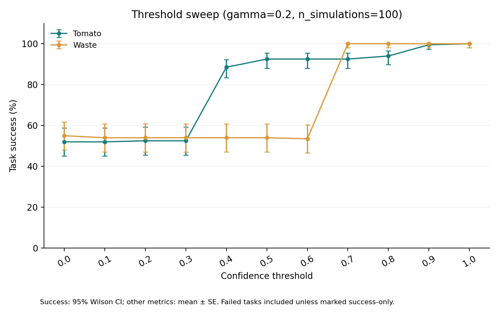
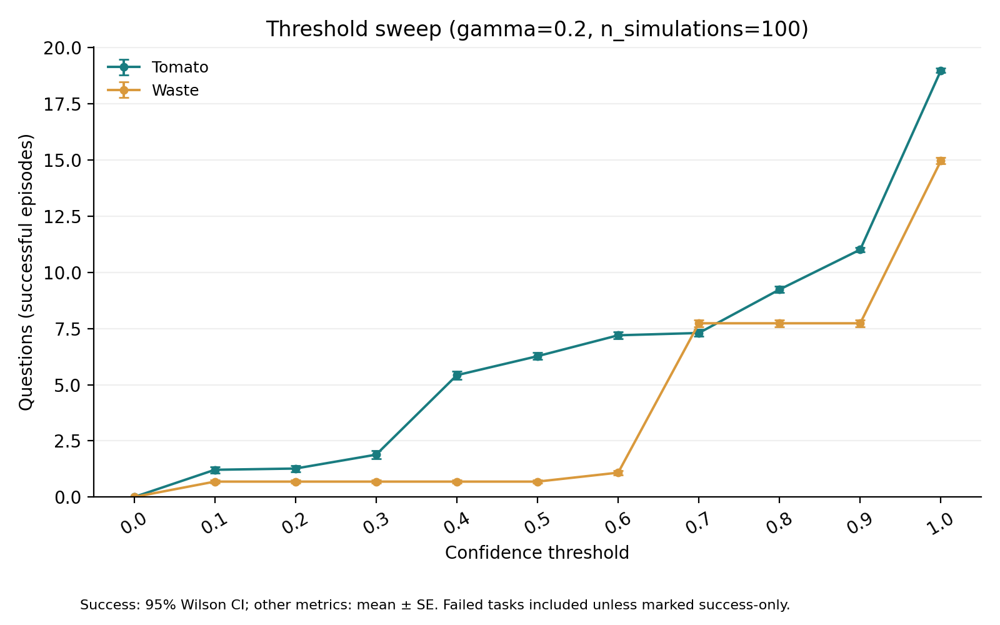
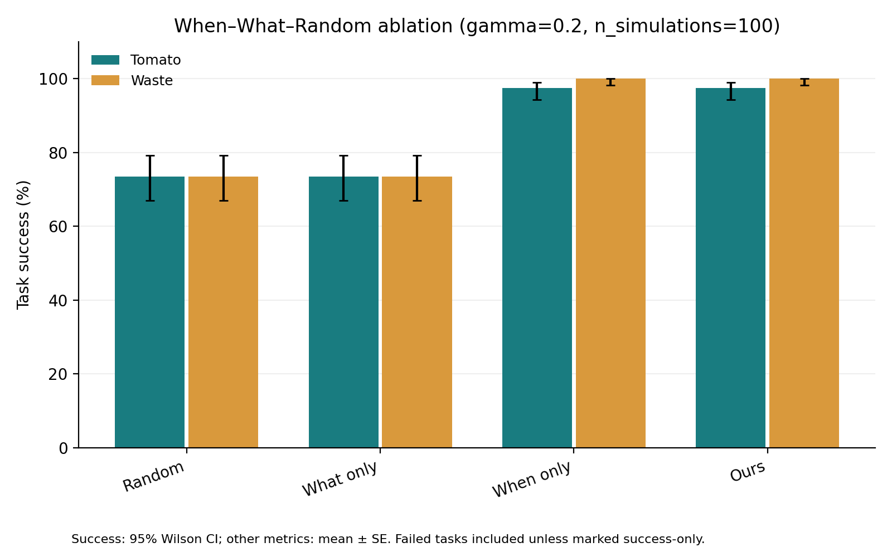
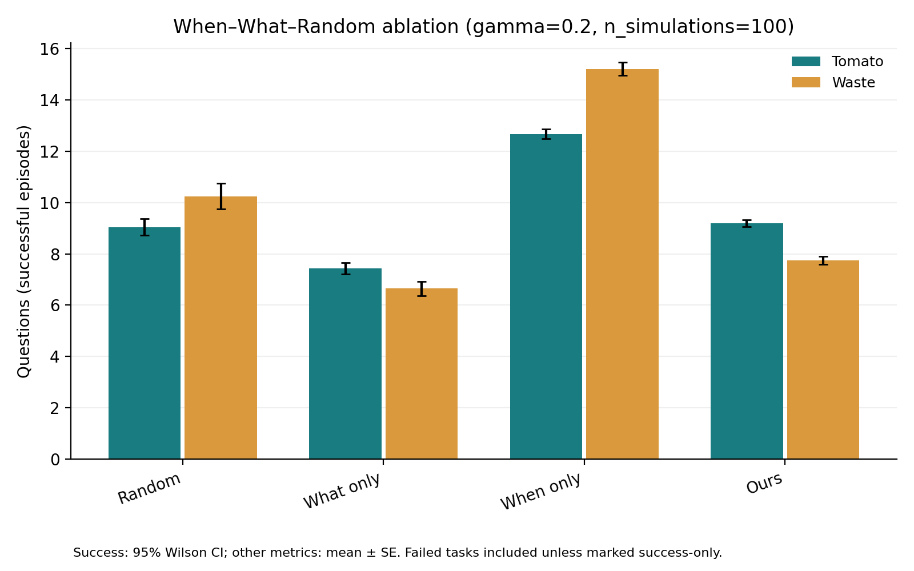
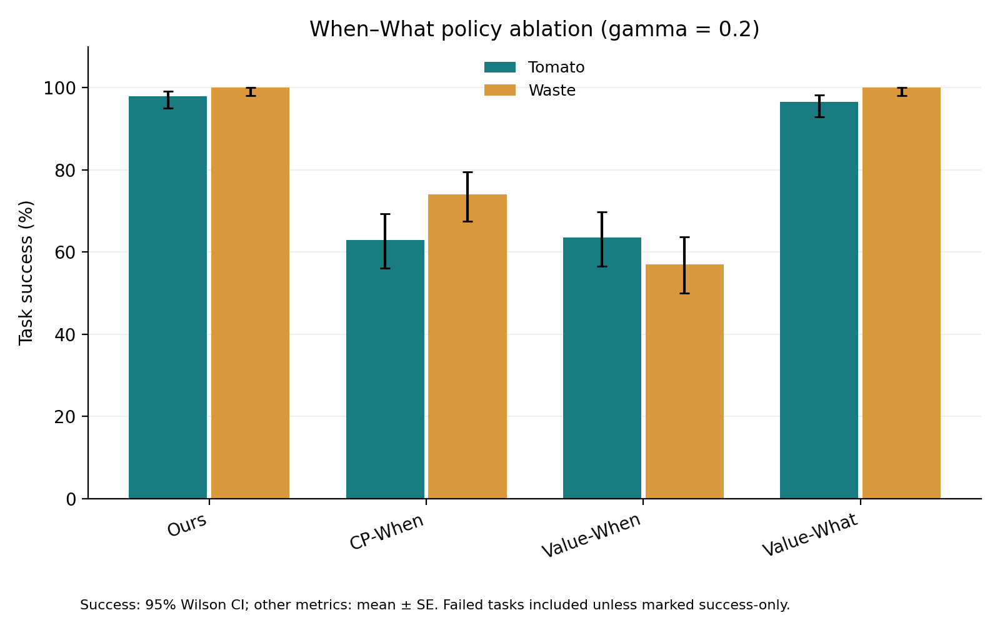
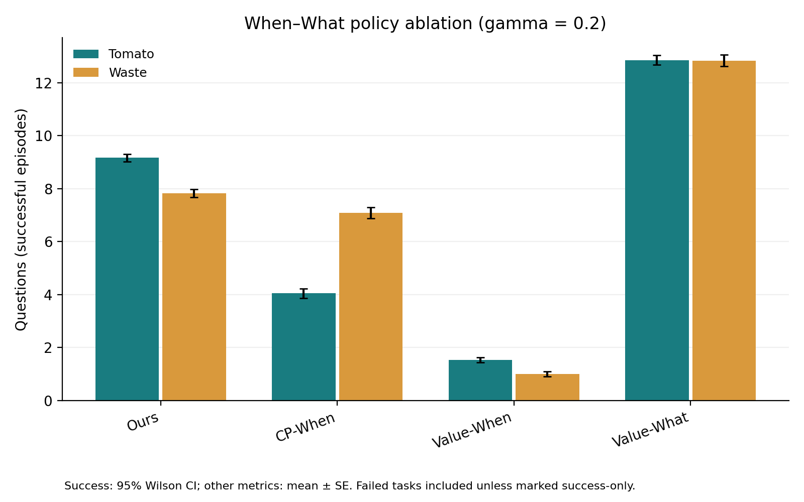
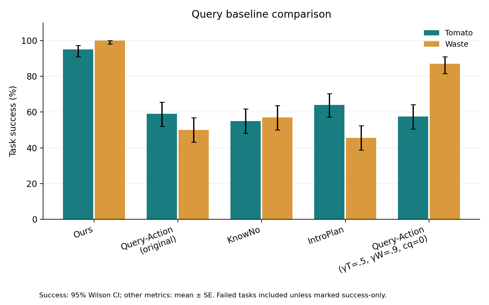
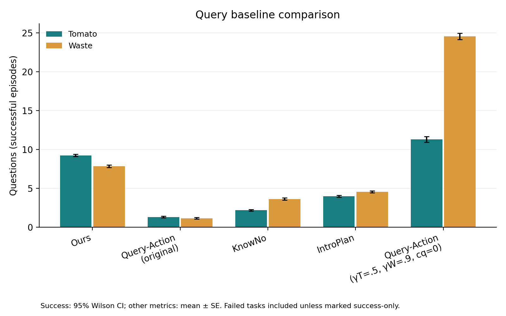

# 실험 결과 통합 보고서

작성 기준일: 2026-09-23  
상세 파라미터: [`EXPERIMENT_SETTINGS.md`](EXPERIMENT_SETTINGS.md)

## 1. 보고서 목적

이 보고서는 `analysis_recent_v2`의 네 핵심 실험을 하나의 논리로 연결한다. 검증하려는
주장은 로봇이 단순히 더 많이 질문해서 성공하는 것이 아니라, 불확실한 상황에서
**언제 질문할지(When)**와 **무엇을 질문할지(What)**를 구분해 결정함으로써 높은
task success와 낮은 human query burden을 함께 달성한다는 것이다.

실험은 다음 질문에 차례로 답한다.

1. Confidence threshold가 성공률과 질문 수를 어떻게 바꾸는가?
2. Proposed When과 What은 각각 어떤 역할을 하는가?
3. CP 또는 action-value 기반 대안도 같은 효과를 내는가?
4. 완성된 방법은 기존 query baseline보다 나은가?

## 2. 실험 구성

| 실험 | 비교 조건 | 실행 슬롯 | 유효 결과 | POMCP simulations |
|---|---|---:|---:|---:|
| Threshold sweep | threshold 0.0–1.0 | 4,400 | 4,400 | 100 |
| When–What random ablation | Random / What only / When only / Ours | 1,600 | 1,600 | 100 |
| When–What policy ablation | Ours / CP-When / Value-When / Value-What | 1,600 | 1,596 + 오류 4건 | 100 |
| Baseline comparison | Ours / Query-Action / KnowNo / IntroPlan / selected Query-Action | 2,000 | 2,000 | POMCP 조건 100 |

두 domain(Tomato, Waste Sorting), domain별 5개 scene, 조건·scene별 40회 실행을
사용한다. 성공률 오차막대는 95% Wilson interval이고 연속 지표는 mean ± SE다.
Policy ablation의 CP-When parsing 오류 4건은 task failure로 성공률 분모에 포함한다.
성공률은 전체 실행을 분모로 계산하고, 질문 수와 step 수는 **성공한 episode만**을
대상으로 집계한다.

## 3. Threshold sweep

질문이 거의 발생하지 않는 threshold 0.0–0.3에서는 성공률이 약 53%에 머물렀다.
Threshold가 0.7 이상이 되면 성공률이 급격히 상승하며, 질문을 허용하는 범위와 task
success가 직접 연결됨을 보여준다.

| Threshold | 성공/전체 | 성공률 | 성공 episode당 질문 수 |
|---:|---:|---:|---:|
| 0.0 | 214/400 | 53.50% | 0.00 |
| 0.7 | 385/400 | 96.25% | 7.53 |
| **0.8** | **388/400** | **97.00%** | **8.46** |
| 0.9 | 399/400 | 99.75% | 9.37 |
| 1.0 | 400/400 | 100.00% | 16.98 |

후속 실험에는 성공률과 질문 비용을 함께 고려한 절충값으로 **threshold 0.8**을 사용했다.
이 설정은 97.0%의 성공률을 달성하면서, 항상 질문을 허용하는 1.0보다 성공 episode당
질문을 8.52회 줄인다. Threshold sweep의 목적은 하나의 절대 최적값을 주장하는 것이
아니라, 0.8을 높은 성공률과 제한된 질문 비용 사이의 operating point로 정하는 것이다.

## 4. When과 What의 기능적 기여

2×2 ablation은 When과 What이 서로 다른 지표에 기여함을 보여준다.

| 조건 | When | What | 성공률 | 성공 episode당 질문 수 |
|---|---|---|---:|---:|
| Random | Random | Random | 73.50% | 9.65 |
| What only | Random | Ours | 73.50% | 7.04 |
| When only | Ours | Random | 98.75% | 13.96 |
| **Ours** | **Ours** | **Ours** | **98.75%** | **8.47** |

### When의 역할

Random What을 고정하고 proposed When을 적용하면 성공률이 73.50%에서 98.75%로
**25.25%p 상승**한다. Proposed What을 고정한 비교에서도 73.50%에서 98.75%로
같은 폭만큼 상승한다. 즉 이 결과에서 When은 질문 횟수를 최소화하는 요소라기보다,
질문이 필요한 순간을 포착해 **task failure를 방지하는 요소**다.

### What의 역할

Random When에서 proposed What으로 교체하면 성공률은 73.50%로 유지되면서 성공
episode당 질문이 9.65회에서 7.04회로 감소한다. Proposed When을 고정하면 성공률은
98.75%로 유지되고 질문은 13.96회에서 8.47회로 **5.50회(39.4%) 감소**한다. 따라서 What의 기여는
추가 성공률보다 **같은 성공 수준을 더 적은 질문으로 달성하는 것**이다.

이 결과가 contribution과 가장 직접적으로 연결된다. When은 reliability를, What은
query efficiency를 담당하며, 두 결정을 결합해야 높은 성공률과 제한된 질문 비용을
동시에 얻는다.

## 5. When–What policy ablation

Random보다 구조화된 대안인 action conformal prediction과 query-action value를 사용해도
proposed policy와 같은 trade-off가 나오는지 확인했다.

| 조건 | 성공/전체 | 성공률 | 성공 episode당 질문 수 |
|---|---:|---:|---:|
| **Ours** | **396/400** | **99.00%** | **8.49** |
| CP-When | 274/400 | 68.50% | 5.69 |
| Value-When | 241/400 | 60.25% | 1.28 |
| Value-What | 393/400 | 98.25% | 12.84 |

CP-When과 Value-When은 질문 수가 적지만 성공률이 각각 30.5%p와 38.75%p 낮다.
이는 질문 수만 최소화한 것이며 유효한 success–query trade-off가 아니다. CP-When의
4개 parsing 오류를 모두 제외하더라도 약 30%p의 차이는 설명되지 않는다.

Value-What은 Ours와 비슷한 성공률을 유지했다. Paired 성공률 차이는 0.75%p이고
통계적으로 유의하지 않았다(`p=0.25`). 그러나 Ours는 Value-What보다 episode당 평균
**4.35회 적게 질문**했다. 이는 EIG 기반 What의 장점이 성공률 상승보다는 질문 내용의
정보성을 높여 반복 질문을 줄이는 데 있다는 해석을 지지한다.

## 6. Baseline comparison

| 방법 | 성공/전체 | 성공률 | 성공 episode당 질문 수 |
|---|---:|---:|---:|
| **Ours** | **390/400** | **97.50%** | **8.51** |
| Query-Action original | 218/400 | 54.50% | 1.22 |
| KnowNo | 224/400 | 56.00% | 2.91 |
| IntroPlan | 219/400 | 54.75% | 4.20 |
| Query-Action selected | 289/400 | 72.25% | 19.25 |

Ours는 original Query-Action, KnowNo, IntroPlan보다 성공률이 41.5–43.0%p 높다.
세 baseline은 성공 episode에서도 질문 수가 더 적지만 성공률이 54.5–56.0%에
머문다. 따라서 이들은 Ours와 동등한 task reliability를 더 적은 질문으로 달성한
방법이 아니며, 질문 수만으로 더 효율적이라고 판단할 수 없다.

Domain별 gamma와 zero query cost를 적용한 selected Query-Action은 성공률을 72.25%까지
높였지만, 성공 episode당 질문이 19.25회로 증가했다. Ours는 이 조건보다 성공률이
25.25%p 높고 성공 episode당 질문은 10.74회 적었다. Paired 성공률 비교도 유의했다(Holm-adjusted
`p=2.25e-24`). 즉 parameter tuning만으로는 Ours의 성공–질문 조합을 재현하지 못했다.

## 7. 종합 해석

현재 결과가 뒷받침하는 논리적 흐름은 다음과 같다.

1. 질문을 허용하지 않으면 두 domain에서 성공률이 약 53%에 머문다.
2. Proposed When은 질문이 필요한 시점을 식별해 성공률을 약 25%p 높인다.
3. Proposed What은 성공률을 유지하면서 성공 episode의 질문을 최대 39.4% 줄인다.
4. CP/value 기반 대체 정책은 높은 성공률과 낮은 질문 수를 동시에 달성하지 못한다.
5. Ours는 기존 baseline과 tuned Query-Action보다 높은 성공률을 보이며, tuned 조건보다
   질문 수도 적다.

따라서 결과 중심 contribution은 다음처럼 표현할 수 있다.

> Belief-aware When decision은 불확실성으로 인한 task failure를 줄이고, EIG-based What
> decision은 성공에 필요한 human queries를 줄인다. 두 결정을 결합하면 기존 query
> strategy가 달성하지 못한 reliability–query efficiency trade-off를 얻는다.

## 8. 보고 기준
- 성공률은 전체 실행을 기준으로 계산한다. 질문 수와 step 수는 성공한 episode만을
  대상으로 계산해, 실패에 따른 조기 종료가 효율 지표에 섞이지 않도록 한다.

세부 수치와 검정은 각 실험의 `report.md`, 집계값은 `01_processed/summary.csv`, 그림에
사용된 값은 `02_graph_data/figure_data.csv`에서 확인할 수 있다.
