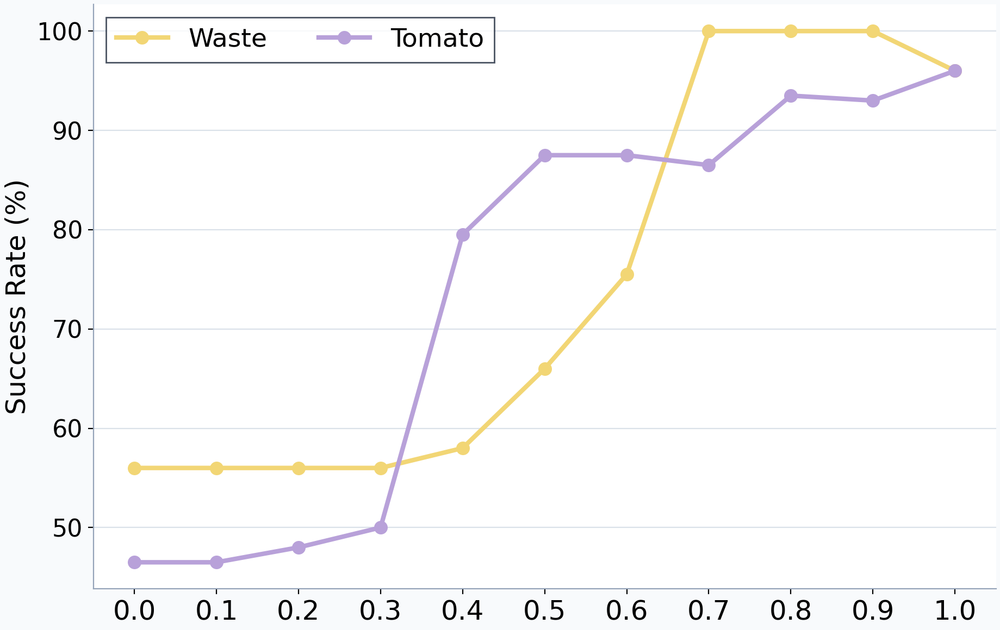
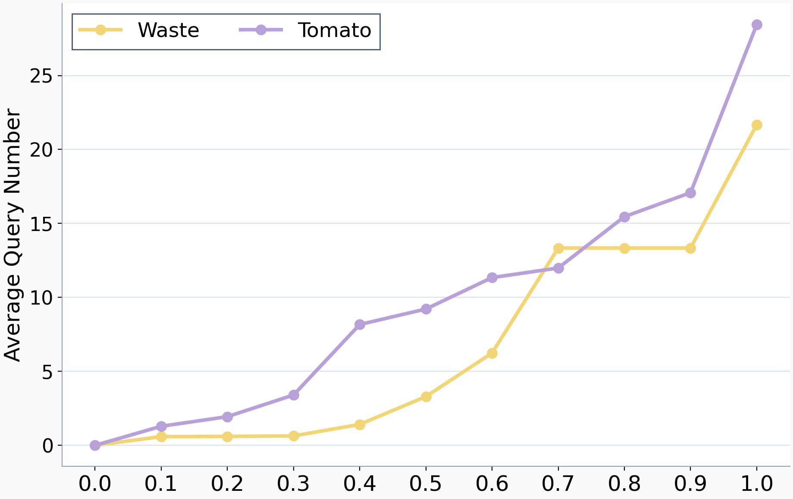
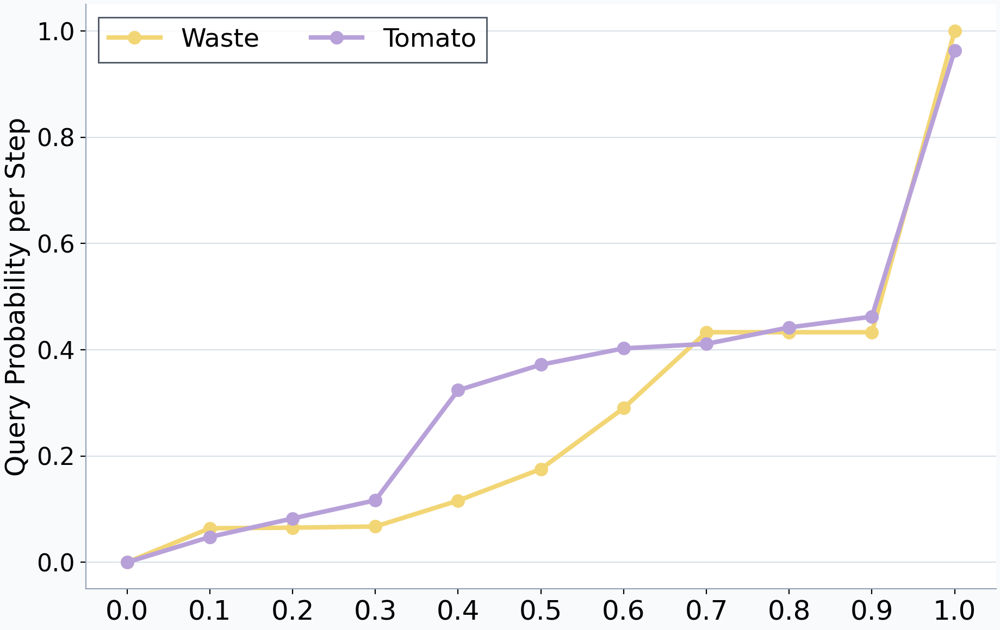
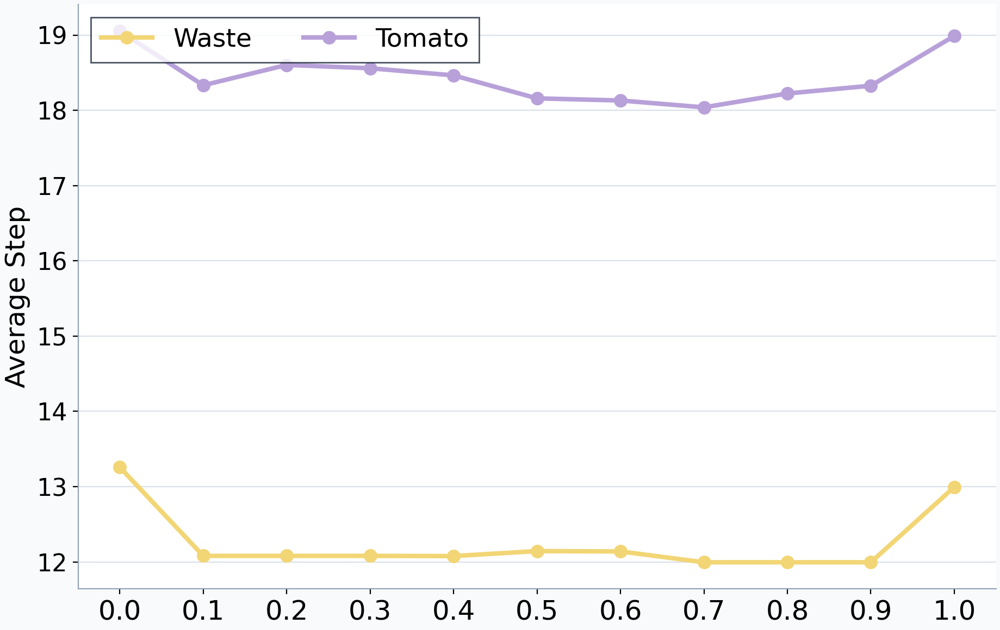
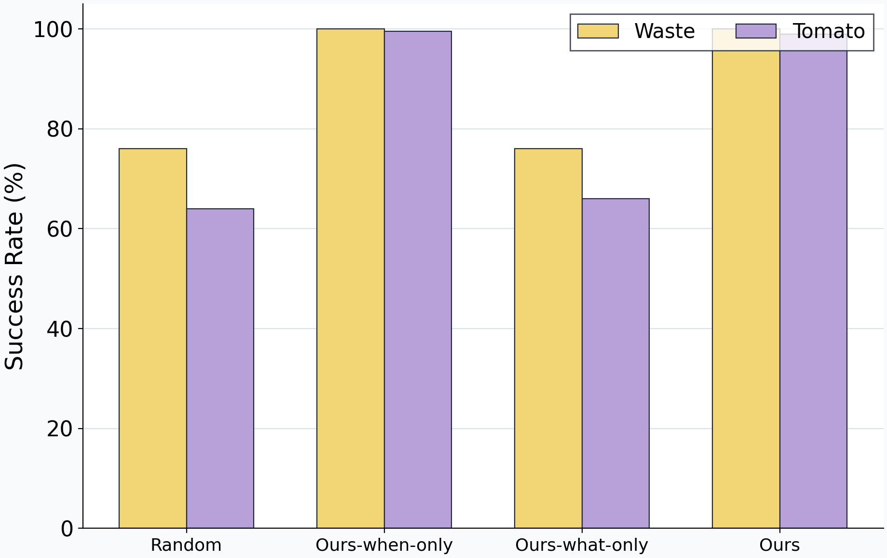
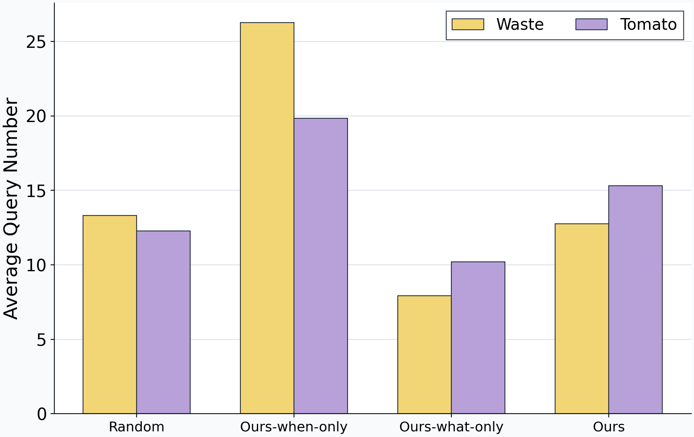
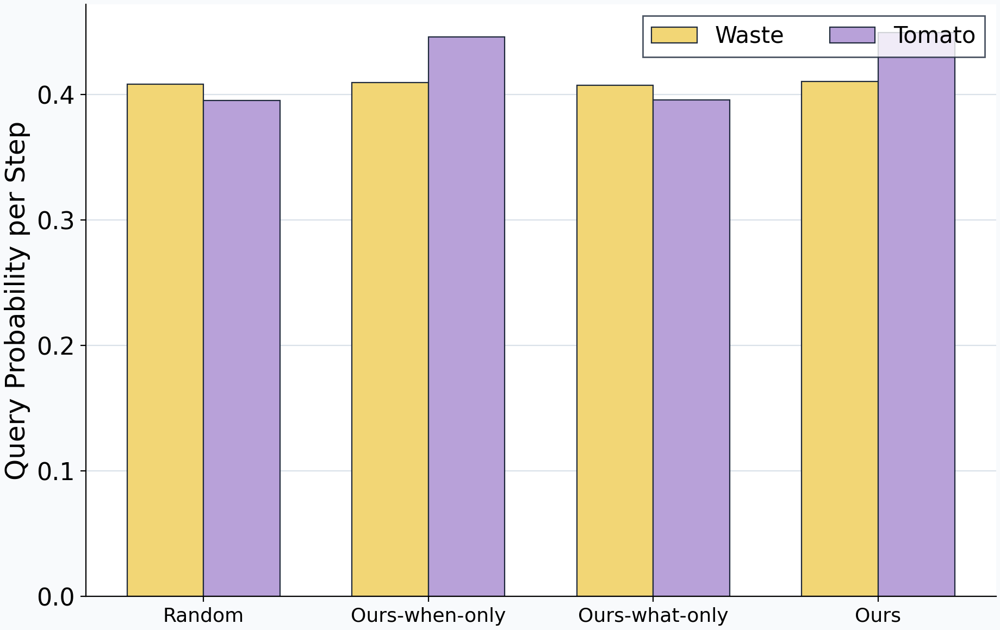
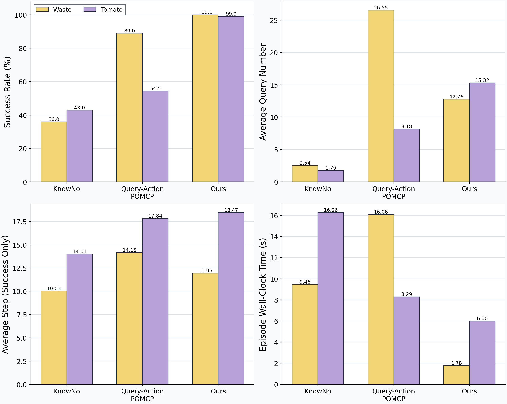

# 시스템 실험결과 보고서

작성일: 2026-09-14  
자료 기준: `main`의 `latex_zips/latex_auro`에 보존된 2026-09-12·13 최종 실험 자산

## 1. 결과 개요

이 보고서는 Threshold sweep, Random When–What ablation, Baseline comparison의 결과를 정리한다. 표는 최종 CSV에서 옮겼으며, 그림은 해당 실험 폴더의 PNG를 본문에 표시하고 PDF를 함께 연결했다. 기존 논문 본문의 이전 수치나 legacy scale 실험은 사용하지 않았다.

| 실험 | 핵심 관찰 |
| --- | --- |
| Threshold sweep | τ = 0.8에서 Waste 100.0%, Tomato 93.5% 성공. τ = 1.0보다 질문 수가 적으며, 성공률과 질문 비용의 절충을 보여줌 |
| When–What ablation | 제안된 질문 시점을 적용한 조건에서 성공률이 크게 높아짐. 여기에 제안된 질문 선택을 적용하면 Ours-when보다 질문 수가 줄어듦 |
| Baseline comparison | Ours가 Waste 100.0%, Tomato 99.0%로 두 baseline보다 높은 성공률. 질문 수와 성공한 실행의 길이는 모든 조건에서 가장 작지는 않음 |

## 2. 실험 구성과 집계 기준

| 실험 | 도메인 | 조건 | 조건·도메인당 실행 | 전체 실행 |
| --- | --- | --- | --- | --- |
| Threshold sweep | Waste, Tomato | τ = 0.0–1.0, 0.1 간격 | 5 scenes × 40 runs = 200 | 4,400 |
| When–What ablation | Waste, Tomato | Random, Ours-when, Ours-what, Ours | 200 | 1,600 |
| Baseline comparison | Waste, Tomato | KnowNo, Query-Action POMCP, Ours | 200 | 1,200 |

전체 실행 수는 각 실험의 조건 수와 셀별 표본 수를 곱한 값이며, 실험 간 공유·재사용 여부까지 고려한 고유 실행 수는 아니다. 각 비교 실험 안에서는 domain/scene/seed를 대응시켜 비교한다. 결과는 Oracle 응답을 사용하는 시스템 평가이며 실제 사용자의 응답 오류·응답시간·주관적 부담을 직접 측정한 사용자 실험은 아니다.

| 지표 | 이 보고서의 집계 기준 |
| --- | --- |
| 성공률 (%) | 성공 에피소드 수 / 전체 에피소드 수 × 100 |
| 평균 질문 수 | 성공·실패를 포함한 전체 에피소드의 질문 수 평균 |
| Query rate | 각 실행의 physical step 중 한 번 이상 질문한 step의 비율을 집계한 값 |
| 평균 step | **성공한 에피소드만** 대상으로 계산 |
| 전체 실행시간 (s) | 성공·실패를 포함한 평균 wall-clock time |
| 성공 실행시간 (s) | **성공한 에피소드만**의 평균 wall-clock time |
| 성공률 차이 (pp) | 비교 조건 성공률 − 기준 조건 성공률; % 상대변화와 구분 |

한 step에서 여러 질문이 가능하므로 Query rate와 평균 질문 수는 같은 지표가 아니다. 성공한 에피소드만의 step·시간은 방법마다 포함된 실행 집합이 다르므로 성공률과 함께 읽어야 한다.

## 3. Threshold sweep

### 3.1 실험 구성

Waste와 Tomato에서 confidence threshold τ를 0.0부터 1.0까지 바꾸었다. 같은 domain/scene/run seed를 threshold 간 공유하고, 최대 physical step은 50이다. 목적은 threshold 증가에 따른 성공률과 질의 비용의 변화를 확인하는 것이다.



그림 1. Threshold에 따른 성공률 · [PDF](latex_zips/latex_auro/figures/system_eval/threshold/success_rate.pdf)



그림 2. Threshold에 따른 전체 실행 평균 질문 수 · [PDF](latex_zips/latex_auro/figures/system_eval/threshold/average_question.pdf)



그림 3. Threshold에 따른 질문 발생 step 비율 · [PDF](latex_zips/latex_auro/figures/system_eval/threshold/query_probability_per_step.pdf)



그림 4. Threshold에 따른 성공 실행 평균 step · [PDF](latex_zips/latex_auro/figures/system_eval/threshold/average_step_success_only.pdf)

### 3.2 Waste 결과

| τ | 성공률 (%) | 평균 질문 수 | Query rate | 성공 평균 step |
| --- | --- | --- | --- | --- |
| 0.0 | 56.0 | 0.0 | 0.00 | 13.3 |
| 0.1 | 56.0 | 0.6 | 0.06 | 12.1 |
| 0.2 | 56.0 | 0.6 | 0.07 | 12.1 |
| 0.3 | 56.0 | 0.6 | 0.07 | 12.1 |
| 0.4 | 58.0 | 1.4 | 0.12 | 12.1 |
| 0.5 | 66.0 | 3.3 | 0.18 | 12.1 |
| 0.6 | 75.5 | 6.2 | 0.29 | 12.1 |
| 0.7 | 100.0 | 13.3 | 0.43 | 12.0 |
| 0.8 | 100.0 | 13.3 | 0.43 | 12.0 |
| 0.9 | 100.0 | 13.3 | 0.43 | 12.0 |
| 1.0 | 96.0 | 21.7 | 1.00 | 13.0 |

### 3.3 Tomato 결과

| τ | 성공률 (%) | 평균 질문 수 | Query rate | 성공 평균 step |
| --- | --- | --- | --- | --- |
| 0.0 | 46.5 | 0.0 | 0.00 | 19.1 |
| 0.1 | 46.5 | 1.3 | 0.05 | 18.3 |
| 0.2 | 48.0 | 1.9 | 0.08 | 18.6 |
| 0.3 | 50.0 | 3.4 | 0.12 | 18.6 |
| 0.4 | 79.5 | 8.2 | 0.32 | 18.5 |
| 0.5 | 87.5 | 9.2 | 0.37 | 18.2 |
| 0.6 | 87.5 | 11.3 | 0.40 | 18.1 |
| 0.7 | 86.5 | 12.0 | 0.41 | 18.0 |
| 0.8 | 93.5 | 15.5 | 0.44 | 18.2 |
| 0.9 | 93.0 | 17.1 | 0.46 | 18.3 |
| 1.0 | 96.0 | 28.4 | 0.96 | 19.0 |

### 3.4 결과 해석

**Waste:** τ = 0.0에서 성공률은 56.0%이며, τ = 0.7–0.9에서 100.0%에 도달한다. 이 구간의 평균 질문 수는 13.3회, Query rate는 .43이다. τ = 1.0에서는 평균 질문 수가 21.7회로 증가하지만 성공률은 96.0%다. 따라서 이 batch에서는 threshold를 최대로 높인 조건이 가장 좋은 결과를 내지 않았다.

**Tomato:** τ = 0.0에서 성공률은 46.5%, τ = 0.8에서 93.5%, τ = 1.0에서 96.0%다. τ = 0.8에서 1.0으로 높이면 성공률은 2.5 pp 증가하지만 평균 질문 수는 15.5회에서 28.4회로 늘고 Query rate도 .44에서 .96으로 증가한다.

**τ = 0.8의 선택 근거:** τ = 1.0 대비 평균 질문 수가 Waste에서 8.4회, Tomato에서 12.9회 적다. 반올림된 표 기준으로 각각 약 38.7%, 45.4% 감소다. Waste에서는 성공률도 더 높고, Tomato에서는 2.5 pp의 성공률 차이를 두고 질문 비용을 줄이는 절충이다. 이를 모든 조건에서 유일한 최적 threshold라고 주장하기보다 두 도메인에서 사용할 운영점으로 해석하는 것이 적절하다.

이 섹션의 비교는 기술통계다. 제공된 threshold 자산에는 별도의 paired 성공률 검정 결과표가 없으므로, threshold 간 차이를 통계적으로 유의하다고 표시하지 않았다.

출처: [Threshold 논문용 CSV](latex_zips/latex_auro/asset/experiments_20260912/threshold/threshold_paper_table.csv) · [실험 구성·기록](latex_zips/latex_auro/asset/experiments_20260912/README.md)

## 4. Random When–What ablation

### 4.1 실험 구성

질문을 시작할 시점(When)과 질문할 사실을 선택하는 방식(What)을 분리했다. 공통 threshold는 τ = 0.8이며, Random 시점 정책의 질문 시작 확률은 .4다. 보고서의 Ours-when, Ours-what은 자산의 Ours-when-only, Ours-what-only에 해당한다.

| 조건 | When: 질문 시작 | What: 질문 내용 선택 |
| --- | --- | --- |
| Random | 무작위 | 무작위 |
| Ours-when | 제안된 confidence 기준 | 무작위 |
| Ours-what | 무작위 | 제안된 사실 선택 |
| Ours | 제안된 confidence 기준 | 제안된 사실 선택 |

질문을 시작한 뒤에는 같은 step에서 추가 질문이 이어질 수 있다. 따라서 시작 확률 .4가 모든 에피소드의 실제 Query rate .4 또는 질문 수 1회를 보장하지 않는다. 정책 정의는 [ablation 실행 코드](when_what_ablation_main.py)와 최종 결과 자산을 기준으로 한다.



그림 5. When–What 조건별 성공률 · [PDF](latex_zips/latex_auro/figures/system_eval/when_what/success_rate.pdf)



그림 6. When–What 조건별 전체 실행 평균 질문 수 · [PDF](latex_zips/latex_auro/figures/system_eval/when_what/average_question.pdf)



그림 7. When–What 조건별 질문 발생 step 비율 · [PDF](latex_zips/latex_auro/figures/system_eval/when_what/query_probability_per_step.pdf)

### 4.2 Waste 결과

| 조건 | 성공률 (%) | 평균 질문 수 | Query rate | 성공 평균 step |
| --- | --- | --- | --- | --- |
| Random | 76.0 | 13.3 | 0.41 | 13.0 |
| Ours-when | 100.0 | 26.3 | 0.41 | 11.9 |
| Ours-what | 76.0 | 7.9 | 0.41 | 13.0 |
| Ours | 100.0 | 12.8 | 0.41 | 11.9 |

### 4.3 Tomato 결과

| 조건 | 성공률 (%) | 평균 질문 수 | Query rate | 성공 평균 step |
| --- | --- | --- | --- | --- |
| Random | 64.0 | 12.3 | 0.40 | 20.0 |
| Ours-when | 99.5 | 19.8 | 0.45 | 18.5 |
| Ours-what | 66.0 | 10.2 | 0.40 | 20.3 |
| Ours | 99.0 | 15.3 | 0.45 | 18.5 |

### 4.4 Paired 성공률 검정

동일 scene/seed에서 기준 조건은 실패하고 비교 조건은 성공하면 개선 pair, 반대이면 악화 pair다. 아래는 보존된 **양측 McNemar exact 검정의 원 p값**이며, 다중비교 보정값은 아니다.

| 도메인 | 기준 → 비교 | n | 차이 (pp) | 개선/악화 pair | McNemar exact p |
| --- | --- | --- | --- | --- | --- |
| Waste | Random → Ours-when | 200 | +24.0 | 48 / 0 | 7.11e-15 |
| Waste | Random → Ours-what | 200 | +0.0 | 1 / 1 | 1 |
| Waste | Random → Ours | 200 | +24.0 | 48 / 0 | 7.11e-15 |
| Waste | Ours-when → Ours | 200 | +0.0 | 0 / 0 | 1 |
| Waste | Ours-what → Ours | 200 | +24.0 | 48 / 0 | 7.11e-15 |
| Tomato | Random → Ours-when | 200 | +35.5 | 71 / 0 | 8.47e-22 |
| Tomato | Random → Ours-what | 200 | +2.0 | 10 / 6 | 0.454 |
| Tomato | Random → Ours | 200 | +35.0 | 70 / 0 | 1.69e-21 |
| Tomato | Ours-when → Ours | 200 | -0.5 | 0 / 1 | 1 |
| Tomato | Ours-what → Ours | 200 | +33.0 | 66 / 0 | 2.71e-20 |

### 4.5 결과 해석

**When은 성공률과 강하게 연결된다.** Random에서 질문 시점만 제안 방식으로 바꾸면 Waste의 성공률은 76.0%에서 100.0%, Tomato는 64.0%에서 99.5%로 높아진다. 두 도메인 모두 paired 검정에서도 큰 차이가 나타난다. 반대로 무작위 시점을 유지한 Ours-what은 Waste 76.0%, Tomato 66.0%로, Random 대비 성공률 향상 근거가 뚜렷하지 않다(Tomato p = .454).

**What의 기여는 질문 비용에서 나타난다.** Ours-when과 Ours의 성공률은 Waste에서 모두 100.0%, Tomato에서 각각 99.5%와 99.0%다. 평균 질문 수는 Waste에서 26.3 → 12.8회, Tomato에서 19.8 → 15.3회로 감소한다. 반올림된 표 기준 각각 약 51.3%, 22.7% 감소다. 두 조건의 Query rate가 각 도메인에서 같게 반올림되어도 질문 수는 크게 다르므로, 질문 시작 빈도만으로 질의 비용을 설명할 수 없다.

따라서 이 결과는 **적절한 시점의 질문이 높은 성공률을 뒷받침하고, 적절한 질문 내용 선택이 그 성공률 수준에서 질문 수를 줄인다**는 해석을 지지한다. 다만 Ours와 Ours-when 사이 p = 1이라는 결과는 통계적 동등성을 입증한 것이 아니며, 질문 수 감소에 대한 별도의 유의성 검정도 제공된 표에는 없다.

출처: [Ablation 논문용 CSV](latex_zips/latex_auro/asset/experiments_20260912/when_what/when_what_paper_table.csv) · [Paired 검정 CSV](latex_zips/latex_auro/asset/experiments_20260912/when_what/when_what_paired_success_contrasts.csv)

## 5. Baseline comparison

### 5.1 실험 구성

KnowNo, Query-Action POMCP, Ours를 Waste·Tomato에서 비교한다. 각 방법·도메인 셀은 200 episodes이며, scene/seed를 대응시킨 성공률 검정 결과가 보존되어 있다. 아래는 2026-09-13 최종 baseline 자산을 사용한다.

세 방법의 차이는 단순히 질문 빈도가 아니라 **사람에게 요청하는 정보와 질문을 결정하는 위치**에 있다. 아래는 연구자가 확인한 baseline 정의를 기준으로 한다.

| 방법 | 질문 시점 결정 | 질문 대상·선택 | 답변의 역할 |
| --- | --- | --- | --- |
| Ours | belief confidence가 threshold보다 낮을 때 별도의 When 규칙으로 결정 | 불확실성을 줄일 상태 사실을 What 규칙으로 선택 | belief를 갱신하고 로봇이 후속 행동을 계획 |
| KnowNo | LLM의 다음 행동 후보를 하나로 확정하기 어려울 때 | 후보 중 다음에 수행할 행동을 선택하도록 요청 | 선택된 행동을 실행 |
| Query-Action POMCP | 일반 행동과 질문 행동의 가치를 POMCP에서 비교 | 행동 집합에 미리 포함한 질문 후보 중 선택 | 질문 결과를 계획에 반영하여 후속 행동 결정 |

**Query-Action POMCP는 다음 행동을 사람에게 선택받는 KnowNo와 다르다.** 질문 자체를 계획 가능한 행동으로 취급하는 baseline이다. 따라서 Ours–KnowNo 비교는 상태 확인과 행동 선택의 차이를, Ours–Query-Action POMCP 비교는 별도 질의 규칙과 계획 내부의 질문 가치 평가의 차이를 중심으로 해석한다.




그림 8. Baseline 종합 비교: 성공률, 전체 평균 질문 수, 성공 평균 step, 전체 평균 실행시간 · [PDF](latex_zips/latex_auro/figures/system_eval/query_baselines/query_baseline_comparison.pdf)

**그림과 논문용 표의 시간 기준:** 위 종합 그림 오른쪽 아래는 **전체 에피소드 평균**이다. 원본 `query_baseline_paper_table.tex`의 시간 열은 **성공한 에피소드만의 평균**이다. 아래 표에는 두 값을 모두 제시하여 차이를 명확히 했다. KnowNo의 시간에는 API 지연이 포함된다.

### 5.2 Waste 결과

| 방법 | 성공률 (%) | 평균 질문 수 | 성공 평균 step | 전체 시간 (s) | 성공 시간 (s) |
| --- | --- | --- | --- | --- | --- |
| KnowNo | 36.0 | 2.54 | 10.03 | 9.46 | 13.07 |
| Query-Action POMCP | 89.0 | 26.55 | 14.15 | 16.08 | 16.98 |
| Ours | 100.0 | 12.76 | 11.95 | 1.78 | 1.78 |

### 5.3 Tomato 결과

| 방법 | 성공률 (%) | 평균 질문 수 | 성공 평균 step | 전체 시간 (s) | 성공 시간 (s) |
| --- | --- | --- | --- | --- | --- |
| KnowNo | 43.0 | 1.79 | 14.01 | 16.26 | 20.74 |
| Query-Action POMCP | 54.5 | 8.18 | 17.84 | 8.29 | 10.38 |
| Ours | 99.0 | 15.32 | 18.47 | 6.00 | 5.96 |

### 5.4 Paired 성공률 검정

| 도메인 | 기준 → 비교 | n | 차이 (pp) | 개선/악화 pair | McNemar exact p |
| --- | --- | --- | --- | --- | --- |
| Waste | KnowNo → Ours | 200 | +64.0 | 128 / 0 | 5.88e-39 |
| Waste | Query-Action POMCP → Ours | 200 | +11.0 | 22 / 0 | 4.77e-07 |
| Tomato | KnowNo → Ours | 200 | +56.0 | 113 / 1 | 1.11e-32 |
| Tomato | Query-Action POMCP → Ours | 200 | +44.5 | 90 / 1 | 7.43e-26 |

위 p값도 다중비교 보정 전 양측 McNemar exact 값이다. Tomato에서는 baseline이 실패하고 Ours가 성공한 pair가 KnowNo 대비 113개, Query-Action POMCP 대비 90개이며, 반대 방향 pair도 각각 1개씩 있다. 따라서 모든 개별 실행에서 Ours가 우세했던 것은 아니다.

### 5.5 Discussion: 질문 방식의 차이로 읽는 결과

#### 5.5.1 Ours–KnowNo: 상태를 확인받는 것과 행동을 선택받는 것

KnowNo는 불확실한 행동 선택을 사람에게 넘기고, Ours는 계획에 필요한 상태 사실을 확인받은 뒤 행동 선택을 로봇이 수행한다. **사람의 답변이 들어오는 지점이 다르다.** KnowNo의 답변은 현재 행동 선택을 직접 해결하고, Ours의 답변은 행동을 선택하는 데 사용되는 belief를 바꾼다.

이번 결과에서 KnowNo는 평균 질문 수가 Waste 2.54회, Tomato 1.79회로 가장 적다. 성공한 실행의 길이도 각각 10.03, 14.01 step으로 가장 짧다. 이는 행동 선택을 직접 지원받는 방식이 성공한 실행에서는 짧은 경로와 적은 질문으로 과제를 진행할 수 있음을 보여준다. 그러나 성공률은 36.0%, 43.0%로, Ours의 100.0%, 99.0%보다 낮다. 따라서 질문 수가 적다는 사실만으로 필요한 불확실성을 효율적으로 해결했다고 판단할 수는 없다.

Ours는 상태 사실에 대한 답변을 belief에 반영한 뒤 후속 행동을 계획한다. 이번 비교에서는 이러한 상태 확인 방식이 행동 선택을 지원받는 KnowNo보다 높은 성공률을 보였다. KnowNo는 적은 질문 수와 짧은 성공 실행 길이를, Ours는 높은 과제 성공률을 보였다는 점에서 두 방법의 결과가 구분된다.

#### 5.5.2 Ours–Query-Action POMCP: 질문을 계획할 것인가, 별도 규칙으로 결정할 것인가

Query-Action POMCP는 미리 정의한 질문 후보를 행동 집합에 넣고 일반 행동과 함께 가치를 평가한다. 질문으로 얻은 정보가 이후 보상을 높일 수 있다면 질문 행동을 선택하는 방식이다. Ours는 질문 여부를 confidence threshold로, 내용을 상태 불확실성을 줄이는 What 규칙으로 결정하고 갱신된 belief에서 후속 행동을 계획한다.

두 접근의 차이는 **정보 획득의 가치를 계획 내부에서 평가하는가, 별도의 상태 기반 기준으로 질문을 결정하는가**다. 질문을 행동으로 넣는 접근은 정보 획득과 과제 수행을 함께 평가할 수 있는 장점이 있지만, 미리 구성한 질문 후보와 가치 추정의 영향을 받는다. Ours는 질문 시점·내용을 명시적인 규칙으로 정하는 대신 그 규칙과 threshold 선택의 영향을 받는다.

**Waste에서는 Ours가 성공률과 질문 수 모두에서 유리하다.** Query-Action POMCP의 성공률 89.0%, 평균 질문 수 26.55회에 비해 Ours는 100.0%, 12.76회다. 성공률은 11.0 pp 높고 평균 질문 수는 약 51.9% 적다. 성공 평균 step도 14.15에서 11.95로 짧다. 이 batch에서는 더 많은 질문을 계획·수행한 것이 더 높은 성공으로 이어지지 않았다.

**Tomato에서는 질문을 더 하면서 성공률을 높이는 절충이 나타난다.** Query-Action POMCP는 평균 8.18회 질문하고 54.5% 성공했으며, Ours는 15.32회 질문하고 99.0% 성공했다. Ours의 질문 수는 약 87.3% 많지만 성공률도 44.5 pp 높다. 따라서 이 도메인의 결과를 질문 비용 감소로 설명하기보다 **더 많은 상태 확인을 수반하는 높은 성공률**로 설명하는 것이 맞다.

두 도메인을 함께 보면, Ours는 Query-Action POMCP보다 일관되게 적게 질문한 것이 아니라 도메인에 따라 다른 질문 수로 높은 성공률을 달성했다. Waste에서는 질문 수와 성공률이 함께 개선되었고, Tomato에서는 더 많은 질문과 높은 성공률이 함께 나타났다. 별도의 When–What 규칙을 사용하는 방식의 성과는 이 두 가지 패턴을 구분해 설명할 수 있다.

#### 5.5.3 질문 수는 성공률과 함께 봐야 한다

세 방법의 평균 질문 수는 동일한 단위로 세지만, 질문이 요구하는 정보와 해결하는 문제가 다르다. KnowNo의 행동 선택 요청과 Ours의 상태 확인 한 번이 사용자에게 같은 인지적 비용을 준다고 가정할 수 없다. 이 실험은 Oracle 응답을 사용하므로 질문 수는 상호작용 횟수의 지표이며, 인간의 workload나 총 응답시간 측정치는 아니다.

전체 평균에는 성공·실패가 함께 포함된다. 실패한 실행이 일찍 끝나면 질문 기회도 줄어들 수 있으므로, 낮은 질문 수가 효율적인 정보 획득만을 의미하지는 않는다. 아래 성공 실행 평균에서도 KnowNo는 적은 질문 수를 보이고 Tomato에서는 Ours가 Query-Action POMCP보다 많이 질문하므로, 방법별 절충 자체는 유지된다.

| 도메인 | KnowNo 성공 평균 질문 수 | Query-Action POMCP 성공 평균 질문 수 | Ours 성공 평균 질문 수 |
| --- | --- | --- | --- |
| Waste | 3.32 | 27.78 | 12.76 |
| Tomato | 2.45 | 10.38 | 15.37 |

출처: [Baseline 상세 집계의 average_question_success_only](latex_zips/latex_auro/asset/experiments_20260913/query_baselines/query_baseline_summary.csv). 성공 실행 집합이 서로 다르므로 이 표도 동일한 episode끼리의 비교는 아니다.

Ours가 목표로 하는 것은 질문 수의 무조건적인 최소화보다 **높은 과제 성공을 얻는 데 필요한 상태 정보를 선택적으로 확보하는 것**으로 해석할 수 있다. Waste에서는 다른 POMCP baseline보다 질문을 줄이면서 성공률을 높였고, Tomato에서는 더 많은 질문을 통해 높은 성공률을 보였다. 두 도메인의 결과를 같은 “질문 감소” 주장으로 합치지 않는 것이 중요하다.

#### 5.5.4 실행시간: 질문 횟수와 질문 결정 비용은 다르다

**KnowNo의 API 호출·응답 대기는 시스템이 동작하는 데 필요한 비용이므로 전체 실행시간에 포함하는 것이 맞다.** API를 포함한 이번 측정에서 Ours는 전체 평균뿐 아니라 성공 평균도 두 도메인에서 가장 짧다. KnowNo가 질문을 적게 했더라도 후보 생성·점수화 등의 처리가 필요하므로, 인간에게 질문한 횟수만으로 실행시간을 설명할 수 없다.

Ours–Query-Action POMCP도 질문 횟수와 시간의 관계가 단순하지 않다. Tomato에서는 Ours가 더 많이 질문하고 성공 평균 step도 더 길지만, 전체시간은 6.00초로 Query-Action POMCP의 8.29초보다 짧다. 성공 평균시간 역시 5.96초와 10.38초다. 즉 물리적 step 수나 질의 수가 곧 계산시간은 아니다.

실행시간 결과는 질문을 몇 번 했는지와 별도로 전체 의사결정 과정의 비용을 평가해야 함을 보여준다. Ours는 Tomato에서 Query-Action POMCP보다 더 많이 질문하면서도 성공 실행시간을 약 42.6% 줄였고, Waste에서는 질문 수와 성공 실행시간을 모두 줄였다. API 대기를 포함한 전체·성공·실패 시간 및 Ours의 내부 계측은 5.7절에 제시한다.

#### 5.5.5 Ablation과 연결되는 결과

4절에서는 질문 시점을 제안 방식으로 바꾼 조건이 높은 성공률을 보였고, 여기에 제안된 질문 선택을 적용하면 질문 수가 줄었다. 이 결과는 baseline 비교의 Ours를 설명할 때 **When은 필요한 시점의 정보 획득, What은 질문당 불확실성 해소 효율**이라는 해석을 뒷받침한다.

Baseline의 paired 성공률 차이는 Waste에서 KnowNo 대비 +64.0 pp, Query-Action POMCP 대비 +11.0 pp이고, Tomato에서는 +56.0 pp와 +44.5 pp다. Scene별 결과에서도 Ours는 Waste의 모든 scene에서 100.0%, Tomato에서는 네 scene에서 100.0%와 한 scene에서 95.0%다. 따라서 높은 성공률이 한 scene에만 집중된 결과는 아니다.

**논문에 넣을 수 있는 discussion 요지:**

> 세 방법은 인간 피드백을 의사결정에 통합하는 방식이 다르다. KnowNo는 다음 행동 선택을 지원받고, Query-Action POMCP는 미리 정의된 질문을 행동 공간에 포함하여 그 가치를 계획 내부에서 평가한다. Ours는 상태 불확실성에 근거해 질문 시점과 내용을 결정하고, 답변으로 갱신된 belief에서 후속 행동을 계획한다. 평가한 두 도메인에서 Ours는 두 baseline보다 높은 성공률과 짧은 에피소드 실행시간을 보였다. 질문 비용의 효과는 도메인에 따라 달랐다. Waste에서는 Query-Action POMCP보다 적게 질문하면서 성공률을 높였고, Tomato에서는 더 많은 질문을 수반하면서 더 높은 성공률을 달성했다. 이는 제안 방식의 이점을 단순한 질문 횟수 감소보다, 과제 수행에 필요한 상태 정보를 확보하는 방식과 그 계산비용의 관점에서 해석해야 함을 보여준다.

출처: [Baseline 논문용 CSV](latex_zips/latex_auro/asset/experiments_20260913/query_baselines/query_baseline_paper_table.csv) · [상세 집계](latex_zips/latex_auro/asset/experiments_20260913/query_baselines/query_baseline_summary.csv) · [Paired 검정 CSV](latex_zips/latex_auro/asset/experiments_20260913/query_baselines/query_baseline_paired_success_contrasts.csv).

### 5.6 Scene별 성공률

각 scene·방법당 40 episodes다. 아래 표는 전체 평균이 특정 scene의 결과를 가리는지 확인하기 위한 세부 결과다.

| 도메인 | Scene | KnowNo (%) | Query-Action POMCP (%) | Ours (%) |
| --- | --- | --- | --- | --- |
| Waste | scene_01 | 35.0 | 85.0 | 100.0 |
| Waste | scene_02 | 37.5 | 90.0 | 100.0 |
| Waste | scene_03 | 45.0 | 85.0 | 100.0 |
| Waste | scene_04 | 37.5 | 95.0 | 100.0 |
| Waste | scene_05 | 25.0 | 90.0 | 100.0 |
| Tomato | scene_01 | 47.5 | 55.0 | 100.0 |
| Tomato | scene_02 | 37.5 | 55.0 | 100.0 |
| Tomato | scene_03 | 50.0 | 65.0 | 100.0 |
| Tomato | scene_04 | 42.5 | 52.5 | 95.0 |
| Tomato | scene_05 | 37.5 | 45.0 | 100.0 |

출처: [Scene별 집계 CSV](latex_zips/latex_auro/asset/experiments_20260913/query_baselines/query_baseline_scene_summary.csv)

### 5.7 실행시간 상세 분석 — API 지연 포함

#### 비교하려는 시간

비교 지표는 **각 시스템이 에피소드를 시작하여 종료할 때까지 기록한 wall-clock time**이다. KnowNo의 외부 모델 호출은 실행 경로의 일부이므로 생성·점수화 API를 기다리는 시간도 포함한다. API 사용이 필요한 방법의 실사용 실행비용을 평가하면서 그 대기만 제거하면 평가 대상 자체가 바뀐다.

따라서 “API를 포함했기 때문에 시간 비교가 부적절하다”는 해석은 맞지 않는다. 다만 측정값은 현재 구현·실행 환경에서의 전체 소요시간이며, 외부 모델 사용 시간과 로컬 탐색 시간을 나눈 원인 분석은 별도 문제다. Oracle 실험이므로 실제 사람이 질문을 읽고 답하는 대기시간과 물리적 로봇 동작시간을 이 수치에 추가로 포함했다고 볼 수는 없다.

#### 전체·성공·실패 실행시간

전체 및 성공 평균·표준편차는 반올림된 논문용 표보다 정밀한 `query_baseline_summary.csv`를 사용했다. **±는 표준편차(SD)이며 신뢰구간이 아니다.** 실패 평균은 집계 평균에서 다음 식으로 복원한 값이다.

```text
실패 평균시간 = (전체 n × 전체 평균시간 − 성공 n × 성공 평균시간) / 실패 n
```

| 도메인 | 방법 | 성공 / 실패 n | 전체 시간 (s, 평균 ± SD) | 성공 시간 (s, 평균 ± SD) | 실패 시간 (s, 복원 평균) |
| --- | --- | --- | --- | --- | --- |
| Waste | KnowNo | 72 / 128 | 9.460 ± 3.916 | 13.066 ± 0.998 | 7.432 |
| Waste | Query-Action POMCP | 178 / 22 | 16.076 ± 3.832 | 16.975 ± 2.786 | 8.803 |
| Waste | Ours | 200 / 0 | 1.784 ± 0.274 | 1.784 ± 0.274 | 해당 없음 |
| Tomato | KnowNo | 86 / 114 | 16.261 ± 6.057 | 20.738 ± 2.248 | 12.884 |
| Tomato | Query-Action POMCP | 109 / 91 | 8.288 ± 4.100 | 10.384 ± 2.831 | 5.777 |
| Tomato | Ours | 198 / 2 | 6.002 ± 1.828 | 5.960 ± 1.517 | 10.142 |

KnowNo와 Query-Action POMCP는 두 도메인 모두 실패한 실행의 평균시간이 성공한 실행보다 짧다. 따라서 **전체 평균이 짧다는 것만으로 성공적인 과제 수행이 빠르다고 해석하면 안 된다.** 현재 수치에서는 Ours가 전체·성공 평균 모두 가장 짧아, 우위가 실패 실행을 많이 포함해서 생긴 것은 아니다. 실패시간이 짧은 구체적 이유가 조기 중단인지 다른 실패 경로인지는 종료 로그를 확인해야 한다.

Tomato Ours의 실패는 2건뿐이다. 복원 평균은 계산할 수 있지만 실패 실행의 일반적인 특성을 대표한다고 보기는 어렵다.

#### Ours와 baseline의 시간 차이

배수는 `baseline 평균 / Ours 평균`, 감소율은 `(baseline 평균 − Ours 평균) / baseline 평균`이다. 같은 성공 episode끼리 짝지어 비교한 배수가 아니라 **각 방법의 집계 평균 간 비율**이다.

| 도메인 | 비교 baseline | 전체 단축 (s) | 전체 배수 | 전체 감소율 | 성공 단축 (s) | 성공 배수 | 성공 감소율 |
| --- | --- | --- | --- | --- | --- | --- | --- |
| Waste | KnowNo | 7.676 | 5.30배 | 81.1% | 11.282 | 7.32배 | 86.3% |
| Waste | Query-Action POMCP | 14.292 | 9.01배 | 88.9% | 15.191 | 9.52배 | 89.5% |
| Tomato | KnowNo | 10.260 | 2.71배 | 63.1% | 14.778 | 3.48배 | 71.3% |
| Tomato | Query-Action POMCP | 2.286 | 1.38배 | 27.6% | 4.424 | 1.74배 | 42.6% |

**Waste:** Ours는 KnowNo보다 전체 평균이 약 5.30배, 성공 평균이 약 7.32배 짧다. Query-Action POMCP 대비도 각각 약 9.01배, 9.52배 짧다. Ours는 두 방법보다 성공률도 높다.

**Tomato:** Ours는 KnowNo보다 전체 평균이 약 2.71배, 성공 평균이 약 3.48배 짧다. Query-Action POMCP 대비는 각각 약 1.38배, 1.74배다. Waste보다 시간 격차가 작지만, Ours의 성공률은 99.0%로 두 baseline보다 높다.

#### Ours 내부의 시간은 어디에 쓰이는가

`experiments_20260912/when_what/raw_runs.csv`에는 Ours의 실행별 시간 분해가 보존되어 있다. 이 자료의 도메인별 Ours는 각각 200건이고, 전체 평균시간이 baseline summary의 Ours와 소수점 6자리 수준에서 일치한다. 아래는 **그 보존 자료에 대한 분해**이며, baseline의 실행별 원시 로그와 동일성을 전부 대조한 것은 아니다.

| 항목 | Waste | Tomato |
| --- | --- | --- |
| 탐색 / planning | 1.6964 s (95.09%) | 5.9601 s (99.31%) |
| 환경 실행 처리 | 0.0394 s (2.21%) | 0.0182 s (0.30%) |
| belief 업데이트 | 0.0224 s (1.26%) | 0.0091 s (0.15%) |
| Oracle 질의·응답 및 관련 처리 | 0.0233 s (1.31%) | 0.0084 s (0.14%) |
| pruning | 0.0021 s (0.12%) | 0.0053 s (0.09%) |
| 계측 항목 외 잔여·반올림 | 0.0003 s | 0.0005 s |
| 전체 평균 | 1.7839 s | 6.0017 s |

Ours 시간의 약 **95.1%가 Waste의 탐색**, 약 **99.3%가 Tomato의 탐색**이다. 이 기록에서는 질문 처리 자체보다 planning이 주요 시간 비용이다. Tomato의 전체시간 증가 역시 대부분 탐색 시간 증가와 연결된다. `interaction_time`은 자동 Oracle 응답을 포함하는 코드 구간의 처리시간이므로 인간의 실제 응답시간으로 읽지 않는다.

#### KnowNo의 API 시간은 얼마나 되는가

현재 KnowNo 실행 코드는 후보 생성과 점수화 호출을 각각 `gen_elapsed`, `score_elapsed`로 계측한다. 따라서 원시 로그가 있으면 API를 포함한 해당 호출 구간의 합계와 전체시간 대비 비중을 계산할 수 있다. 다만 호출 구간 시간도 서버 추론·네트워크·로컬 요청 처리를 모두 포함하므로, 순수 네트워크 지연과 같은 값은 아니다.

현재 로컬에는 `experiments_logs/`가 없고 최종 baseline CSV에는 두 호출 시간의 집계가 없다. 따라서 **KnowNo 전체시간 중 API 관련 구간이 몇 %인지는 현재 자료로 계산할 수 없다.** 전체시간을 API 시간이라고 간주하거나, Ours와의 시간 차이를 전부 API 탓으로 돌리지는 않는다. Query-Action POMCP도 현재 최종 자산만으로 내부 시간 분해가 어렵다.

**현재 결과로 쓸 수 있는 문장:** “외부 API 호출 대기를 포함한 에피소드 wall-clock time에서 Ours는 두 도메인 모두 가장 짧은 전체·성공 실행 평균을 보였다. 성공 실행 기준으로 KnowNo 대비 Waste 86.3%, Tomato 71.3%의 시간이 감소했다. Ours의 보존된 시간 계측에서는 탐색이 전체시간의 대부분을 차지했다.”

시간 차이는 현재 자료에서의 기술통계로 보고한다. 전체·성공 평균과 SD만으로 seed별 시간의 paired 검정, 중앙값, p95, step별 지연 분포를 복원할 수는 없으므로 해당 수치를 임의로 추가하지 않았다.

근거: [Baseline 상세 집계](latex_zips/latex_auro/asset/experiments_20260913/query_baselines/query_baseline_summary.csv), [Ours 시간 분해를 포함한 ablation 실행별 CSV](latex_zips/latex_auro/asset/experiments_20260912/when_what/raw_runs.csv), [KnowNo Waste 실행 코드](scripts/baseline/scripts/knowno_multistep_wastesorting.py), [KnowNo Tomato 실행 코드](scripts/baseline/scripts/knowno_multistep_tomato.py).

## 6. 세 실험을 함께 읽을 때의 결론

1. **Threshold:** 높은 threshold는 대체로 더 많은 질문과 연결되지만, 성공률이 단조롭게 증가하지는 않는다. τ = 0.8은 질문 비용을 제한하면서 높은 성공률을 얻는 운영점이다.
2. **When–What:** 성공률 향상은 질문 시점의 기여가 크며, 제안된 질문 내용 선택은 높은 성공률 수준에서 질문 수를 줄이는 데 기여한다.
3. **Baseline:** 최종 비교에서 Ours는 가장 높은 성공률과 가장 짧은 측정 실행시간을 보였다. 질문 수와 성공 평균 step에서는 도메인·baseline별 절충이 있다.

**실험 간 수치 구분:** threshold batch의 τ = 0.8과 ablation·baseline의 Ours는 별도 실험 결과다. 예를 들어 Tomato 성공률은 threshold에서 93.5%, ablation·baseline에서는 99.0%다. 같은 이름이나 threshold만으로 동일한 실행 집합으로 취급하거나 수치를 서로 대체하지 않는다. 이 보고서는 각 batch의 보존값을 그대로 사용하며, 차이의 원인을 추정해서 덧붙이지 않았다.

**해석 범위:** 통계표는 성공 여부의 paired 비교이며, 질문 수·실행시간·step 차이의 검정 결과가 아니다. 보존된 자산을 정리한 보고서로 원시 로그를 재실행하지 않았고, 사용자 workload·trust·situation awareness의 향상을 이 시스템 결과만으로 주장하지 않는다.

## 7. 원본 자료와 추가 그림

### 7.1 데이터·통계·재현 자료

**Threshold**

- [raw_runs.csv](latex_zips/latex_auro/asset/experiments_20260912/threshold/raw_runs.csv)
- [threshold_paper_table.csv](latex_zips/latex_auro/asset/experiments_20260912/threshold/threshold_paper_table.csv)
- [threshold_paper_table.tex](latex_zips/latex_auro/asset/experiments_20260912/threshold/threshold_paper_table.tex)
- [threshold_summary.csv](latex_zips/latex_auro/asset/experiments_20260912/threshold/threshold_summary.csv)

**When–What**

- [raw_runs.csv](latex_zips/latex_auro/asset/experiments_20260912/when_what/raw_runs.csv)
- [when_what_paired_success_contrasts.csv](latex_zips/latex_auro/asset/experiments_20260912/when_what/when_what_paired_success_contrasts.csv)
- [when_what_paper_table.csv](latex_zips/latex_auro/asset/experiments_20260912/when_what/when_what_paper_table.csv)
- [when_what_paper_table.tex](latex_zips/latex_auro/asset/experiments_20260912/when_what/when_what_paper_table.tex)
- [when_what_summary.csv](latex_zips/latex_auro/asset/experiments_20260912/when_what/when_what_summary.csv)

**Baseline**

- [analysis_experiment.py](latex_zips/latex_auro/asset/experiments_20260913/query_baselines/analysis_experiment.py)
- [paired_seed_execution_log.csv](latex_zips/latex_auro/asset/experiments_20260913/query_baselines/paired_seed_execution_log.csv)
- [plot_query_baseline_figure.py](latex_zips/latex_auro/asset/experiments_20260913/query_baselines/plot_query_baseline_figure.py)
- [query_baseline_paired_success_contrasts.csv](latex_zips/latex_auro/asset/experiments_20260913/query_baselines/query_baseline_paired_success_contrasts.csv)
- [query_baseline_paper_table.csv](latex_zips/latex_auro/asset/experiments_20260913/query_baselines/query_baseline_paper_table.csv)
- [query_baseline_paper_table.tex](latex_zips/latex_auro/asset/experiments_20260913/query_baselines/query_baseline_paper_table.tex)
- [query_baseline_scene_summary.csv](latex_zips/latex_auro/asset/experiments_20260913/query_baselines/query_baseline_scene_summary.csv)
- [query_baseline_summary.csv](latex_zips/latex_auro/asset/experiments_20260913/query_baselines/query_baseline_summary.csv)

**공통 재현 자료**

- [analysis_experiment.py](latex_zips/latex_auro/asset/experiments_20260912/provenance/analysis_experiment.py)
- [plot_threshold_figure.py](latex_zips/latex_auro/asset/experiments_20260912/provenance/plot_threshold_figure.py)
- [plot_when_what_figure.py](latex_zips/latex_auro/asset/experiments_20260912/provenance/plot_when_what_figure.py)
- [threshold_paired_seeds.csv](latex_zips/latex_auro/asset/experiments_20260912/provenance/threshold_paired_seeds.csv)
- [when_what_paired_seeds.csv](latex_zips/latex_auro/asset/experiments_20260912/provenance/when_what_paired_seeds.csv)

### 7.2 전체 그림 목록

본문에 넣지 않은 보상·전체 step·성공 실행 질문 수 등의 보조 그림도 아래에서 확인할 수 있다. 파일명의 `success_only`는 성공 실행만을 의미한다.

| 실험 | 지표 / 그림 | 미리보기 | 원본 PDF |
| --- | --- | --- | --- |
| threshold | average_question | [PNG](latex_zips/latex_auro/figures/system_eval/threshold/average_question.png) | [PDF](latex_zips/latex_auro/figures/system_eval/threshold/average_question.pdf) |
| threshold | average_question_success_only | [PNG](latex_zips/latex_auro/figures/system_eval/threshold/average_question_success_only.png) | [PDF](latex_zips/latex_auro/figures/system_eval/threshold/average_question_success_only.pdf) |
| threshold | average_reward | [PNG](latex_zips/latex_auro/figures/system_eval/threshold/average_reward.png) | [PDF](latex_zips/latex_auro/figures/system_eval/threshold/average_reward.pdf) |
| threshold | average_step | [PNG](latex_zips/latex_auro/figures/system_eval/threshold/average_step.png) | [PDF](latex_zips/latex_auro/figures/system_eval/threshold/average_step.pdf) |
| threshold | average_step_success_only | [PNG](latex_zips/latex_auro/figures/system_eval/threshold/average_step_success_only.png) | [PDF](latex_zips/latex_auro/figures/system_eval/threshold/average_step_success_only.pdf) |
| threshold | elapsed_time | [PNG](latex_zips/latex_auro/figures/system_eval/threshold/elapsed_time.png) | [PDF](latex_zips/latex_auro/figures/system_eval/threshold/elapsed_time.pdf) |
| threshold | query_probability_per_step | [PNG](latex_zips/latex_auro/figures/system_eval/threshold/query_probability_per_step.png) | [PDF](latex_zips/latex_auro/figures/system_eval/threshold/query_probability_per_step.pdf) |
| threshold | success_rate | [PNG](latex_zips/latex_auro/figures/system_eval/threshold/success_rate.png) | [PDF](latex_zips/latex_auro/figures/system_eval/threshold/success_rate.pdf) |
| when_what | average_question | [PNG](latex_zips/latex_auro/figures/system_eval/when_what/average_question.png) | [PDF](latex_zips/latex_auro/figures/system_eval/when_what/average_question.pdf) |
| when_what | average_question_success_only | [PNG](latex_zips/latex_auro/figures/system_eval/when_what/average_question_success_only.png) | [PDF](latex_zips/latex_auro/figures/system_eval/when_what/average_question_success_only.pdf) |
| when_what | average_reward | [PNG](latex_zips/latex_auro/figures/system_eval/when_what/average_reward.png) | [PDF](latex_zips/latex_auro/figures/system_eval/when_what/average_reward.pdf) |
| when_what | average_step | [PNG](latex_zips/latex_auro/figures/system_eval/when_what/average_step.png) | [PDF](latex_zips/latex_auro/figures/system_eval/when_what/average_step.pdf) |
| when_what | average_step_success_only | [PNG](latex_zips/latex_auro/figures/system_eval/when_what/average_step_success_only.png) | [PDF](latex_zips/latex_auro/figures/system_eval/when_what/average_step_success_only.pdf) |
| when_what | query_probability_per_step | [PNG](latex_zips/latex_auro/figures/system_eval/when_what/query_probability_per_step.png) | [PDF](latex_zips/latex_auro/figures/system_eval/when_what/query_probability_per_step.pdf) |
| when_what | success_rate | [PNG](latex_zips/latex_auro/figures/system_eval/when_what/success_rate.png) | [PDF](latex_zips/latex_auro/figures/system_eval/when_what/success_rate.pdf) |
| query_baselines | average_question | [PNG](latex_zips/latex_auro/figures/system_eval/query_baselines/average_question.png) | [PDF](latex_zips/latex_auro/figures/system_eval/query_baselines/average_question.pdf) |
| query_baselines | average_question_success_only | [PNG](latex_zips/latex_auro/figures/system_eval/query_baselines/average_question_success_only.png) | [PDF](latex_zips/latex_auro/figures/system_eval/query_baselines/average_question_success_only.pdf) |
| query_baselines | average_step_success_only | [PNG](latex_zips/latex_auro/figures/system_eval/query_baselines/average_step_success_only.png) | [PDF](latex_zips/latex_auro/figures/system_eval/query_baselines/average_step_success_only.pdf) |
| query_baselines | query_baseline_comparison | [PNG](latex_zips/latex_auro/figures/system_eval/query_baselines/query_baseline_comparison.png) | [PDF](latex_zips/latex_auro/figures/system_eval/query_baselines/query_baseline_comparison.pdf) |
| query_baselines | success_rate | [PNG](latex_zips/latex_auro/figures/system_eval/query_baselines/success_rate.png) | [PDF](latex_zips/latex_auro/figures/system_eval/query_baselines/success_rate.pdf) |
| query_baselines | wall_clock_time | [PNG](latex_zips/latex_auro/figures/system_eval/query_baselines/wall_clock_time.png) | [PDF](latex_zips/latex_auro/figures/system_eval/query_baselines/wall_clock_time.pdf) |
| query_baselines | wall_clock_time_success_only | [PNG](latex_zips/latex_auro/figures/system_eval/query_baselines/wall_clock_time_success_only.png) | [PDF](latex_zips/latex_auro/figures/system_eval/query_baselines/wall_clock_time_success_only.pdf) |

